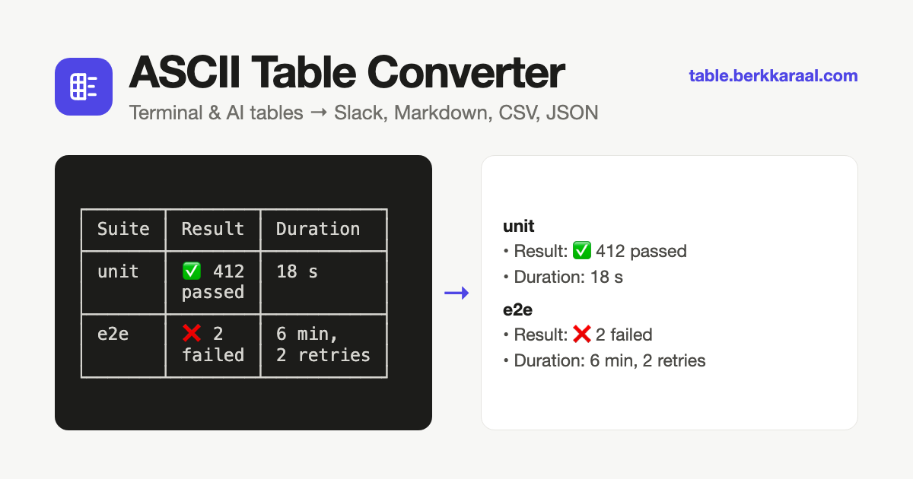

# ASCII Table Converter

**Turn the box tables that AI agents and terminals print into something your team can actually read.**

👉 **[table.berkkaraal.com](https://table.berkkaraal.com)**



## Why

Claude Code, Codex, MySQL, `docker ps` and friends print tables like this:

```
┌───────┬────────┬───────────┐
│ Suite │ Result │ Duration  │
├───────┼────────┼───────────┤
│ unit  │ ✅ 412 │ 18 s      │
│       │ passed │           │
├───────┼────────┼───────────┤
│ e2e   │ ❌ 2   │ 6 min,    │
│       │ failed │ 2 retries │
└───────┴────────┴───────────┘
```

They look great in a terminal and fall apart everywhere else, in two ways:

- **The font.** Chat apps use a proportional font, so the columns stop lining up. Wrapping the table in a code block fixes this part.
- **The width.** Every row wider than the message area wraps onto several lines, and a code block doesn't help with that. One table row turns into a jumble of half-rows and borders.

Paste the table into ASCII Table Converter and copy it back out in a format that survives:

```
*unit*
• Result: ✅ 412 passed
• Duration: 18 s

*e2e*
• Result: ❌ 2 failed
• Duration: 6 min, 2 retries
```

## Features

- **Paste anything.** Whole agent replies are fine: text around the tables is ignored, and when there are several tables you pick which one to convert.
- **Wrapped cells are fixed.** Cells the terminal split over several lines are joined back into one value, or kept as line breaks if you prefer.
- **11 output formats**, each one click to copy.
- **Copy as rich table** puts a real table on the clipboard that pastes as rows and columns into Slack, Google Docs, Notion, Confluence, Gmail, Word and Sheets.
- **Code block that fits.** The monospace version wraps columns to a width you choose, breaking words only as a last resort.
- **Remembers your choices**: format, width and options are saved in your browser.
- **Private by design.** Everything runs in your browser. No uploads, no cookies, no analytics.
- Light and dark mode, works on mobile.

## Supported inputs

Detected automatically; you can also force a type.

| Input                 | Example                    | Typical sources                           |
| --------------------- | -------------------------- | ----------------------------------------- |
| Unicode box tables    | `┌─┬─┐` `│ a │ b │`        | Claude Code, Python rich, SQLite box mode |
| ASCII box tables      | `+---+` `\| a \| b \|`     | MySQL, SQLite table mode                  |
| Markdown pipe tables  | `\| a \| b \|` + `\|---\|` | ChatGPT, Codex, Gemini                    |
| Space-aligned columns | `NAME   STATUS`            | `docker ps`, `kubectl get` (best guess)   |

## Output formats

| Group      | Formats                                            | Good for                              |
| ---------- | -------------------------------------------------- | ------------------------------------- |
| Chat       | Row blocks, Bullet list, Code block (width-fitted) | Slack, Teams, Discord                 |
| Markup     | Markdown, Jira / Confluence wiki, HTML             | GitHub, Notion, Obsidian, Jira, wikis |
| Data       | CSV, TSV, JSON                                     | Excel, Google Sheets, scripts         |
| Plain text | ASCII table, Records (`Header: value` blocks)      | Email, tickets, anywhere              |

## Built with

[Svelte 5](https://svelte.dev), TypeScript and [Vite](https://vite.dev). A static site, prerendered at build time and hosted on GitHub Pages.

## Contributing

Bug reports, table samples that don't convert well and pull requests are welcome. See [CONTRIBUTING.md](CONTRIBUTING.md).

## License

[MIT](LICENSE) © Berk Karaal
